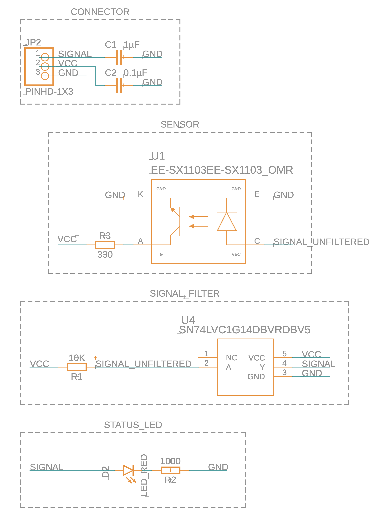
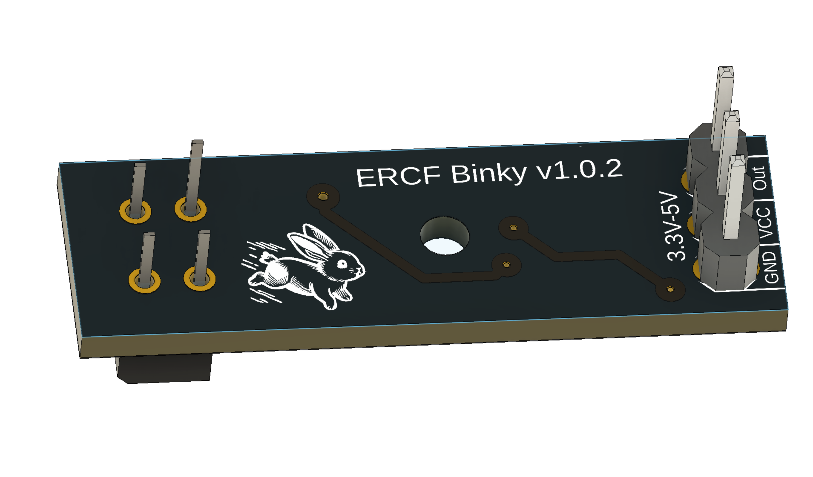
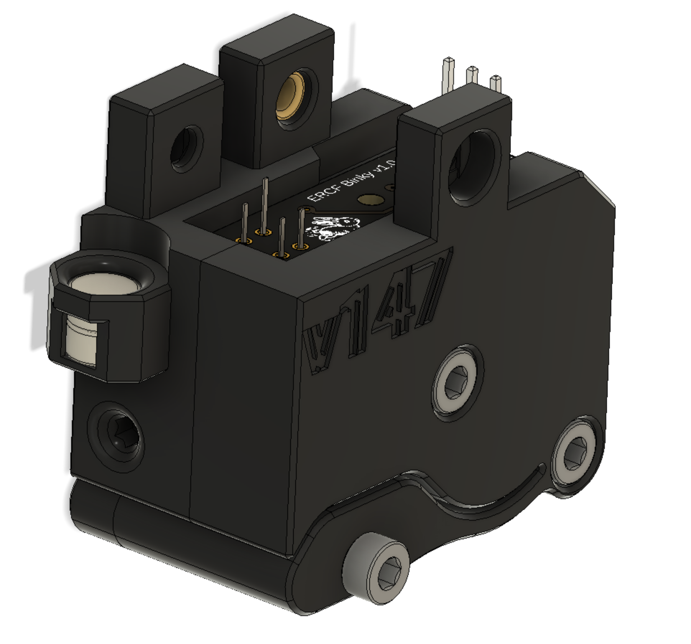
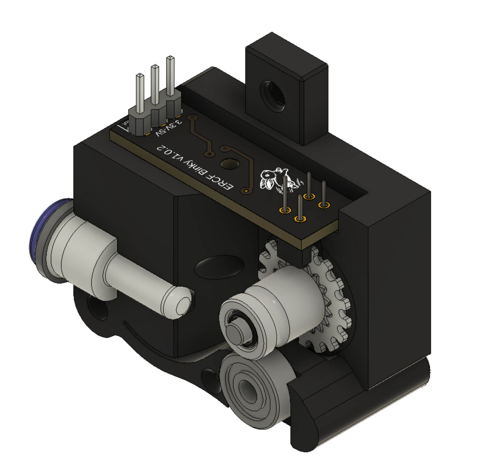
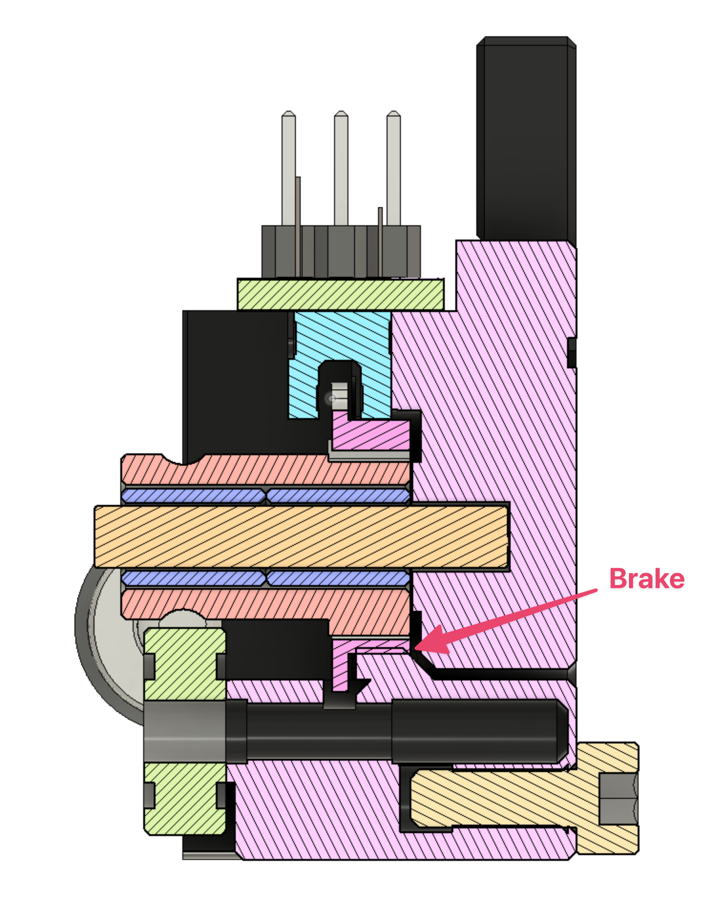

# ERCF Binky Encoder

The original Filament Encoder of ERCF based on the [TCRT5000 PCBs](Images/TCRT5000.jpg) is working for some people but is also creating headaches for lots of other people and also makes up quite a good amount of support questions on discord.
I gave up getting it to work properly after ~10h and instead started to experiment with a different kind of sensor that uses a slotted wheel instead.
First i tried a readily available [KY-010](https://www.google.com/search?q=ky-010) but sadly that board does not have any
filtering which causes fales pulses on the "edge".
So instead i created a new PCB based on the same small Omron sensor that is used on the KY-010 board, the [EE-SX398](https://omronfs.omron.com/en_US/ecb/products/pdf/en-ee_sx398_498.pdf).
It's tiny, reliable and cheap, so i combined it onto a PCB with a schmitt filter to filter out false edge readings and also added a led like the TCRT5000 boards.

## PCB Availability

If you don't want to produce the boards yourself there are currently 3 Shops where you can get a binky right now:

| Name         | URL                                                            | Ships to  | 
| ------------ | -------------------------------------------------------------- | --------- |
| **My Shop**: | https://www.etsy.com/de/listing/1526104169/erkf-binky          | Worldwide |
| **Lab4450**: | https://lab4450.com/product/ercf-binky/                        | Europe    |
| **JB3D.uk**: | [https://jb3d.uk/](https://jb3d.uk/product/ercf-binky-pcb/)    | Worldwide |

Feel free to produce and sell these yourself if you like, a small donation would be appreciated 😊  ([donate through PayPal](https://www.paypal.com/donate/?hosted_button_id=5Y3M77S3U3EEW)) 
Just drop me a DM on Discord if you'd like to be added to the list above

## Setup/Configuration

1. Print Binky STLs with default voron print settings, make sure to print the slotted wheel in black to prevent light of the sensor passing through it
2. push the slotted wheel onto the BMG gear with the push tool, by placing the side with the get teeth onto a flat surface, sliding over the slottet wheel loosly and then puttin the push tool on to to "tap" it into place lightly with a hammer, and i mean really lightly, don't just smash it ;)
3. put the BMG Gear with the slotted wheel, pin and bearings into the bigger side of the encoder and put the binky pcb on top. release the brake by slightly pulling down the spring and make sure the slotted wheel can turn freely between the sensor block. if not make sure the slotted wheel is seated correctly (flat to the outside of the BMG gear).
4. if everything runs smoothly put the whole encoder together and install on the ERCF
5. change this `DEFAULT_ENCODER_RESOLUTION = 0.67` near the top of `~/ERCF-Software-V3/extras/ercf.py` to `DEFAULT_ENCODER_RESOLUTION = 1.0`
6. run ERCF_CALIBRATE_ENCODER to update the encoder resolution config (see Encoder Calibration in the ERCF_Manual.pdf on page 111)

## Resolution

Binky uses a resolution of 1mm/pulse instead of the 0.67mm/pulse the old encoder produced because @moggieuk realized, that klipper can actually not keep up with the resolution of the old encoder on high speeds: 

> The other problem is that the resolution is too high -- Klipper cannot reliably poll fast movements and steps can be lost.  This is especially true because the current encoder design can have very irregular waveform (pulses) -- short ones can get missed.  Binky reduces resolution to about 1mm (from 0.67 in current design) but has 50% duty cycle on the waveform meaning that Klipper can keep up with about 350mm/s move (i.e. above practical limits).  The other thing is that it just works - no fiddling with distance of sensor from BMG gear etc. 
> It is so reliable now that it has exposed other issues that we are fixing in ERCF v2 and Happy Hare v2, namely Klipper can be slow to update on some occasions means that a prematurely read encoder will read short, or that moves in one direction are different from the other -- that was actually only discovered 2 days ago and a fix is almost done.

### Binky Definition

noun, plural bin·kies. 
the playful twisting leap that a rabbit makes, usually with a 180–turn in midair.

[Gif of a bunny doing a Binky](https://i.gifer.com/origin/eb/eb16649d507bedd98d8b4ef09b3748fc.gif)

### Binky Schematic and PCB

### Encoder

The encoder itself is a drop in replacement for the old one, you can simply replace the old encoder with this new version, including the 3 pin cable.

Internally it uses a 3D printed slotted wheel, that's pressed on the bondtech gear which then cuts blocks the light of the EE-SX398 when the filament moves.
The slotted wheel has the same amount of slots, so that it's compatible with the old software values based on the TCRT5000.
Aside from the ERCF_CALIBRATE_ENCODER Macro no changes to the software are needed.

Here's a crosscut view that also shows a small additional feature, there is a "brake" that stops the bondtech gear when no filament is present, so that the bondtech gear doesn't keep spinning when rapidly ejecting the filament on unload.

### BOM

The BOM is the same as the OLD encoder aside from a M2x10 self tapping screw for plastic instead of the M3x8SHCS to fasten the PCB

<a property="dct:title" rel="cc:attributionURL" href="https://github.com/mneuhaus/EnragedRabbitProject/blob/main/usermods/Binky/Readme.md">Binky</a> by <a rel="cc:attributionURL dct:creator" property="cc:attributionName" href="https://github.com/mneuhaus">Marc Neuhaus</a> is licensed under <a href="http://creativecommons.org/licenses/by-sa/4.0/?ref=chooser-v1" target="_blank" rel="license noopener noreferrer" style="display:inline-block;">CC BY-SA 4.0</a>

